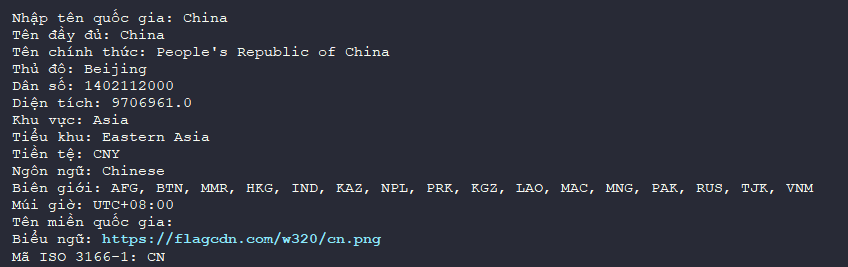

# International Country Check - @T7C


Đây là mã python đơn giản sử dụng thư viện `requests` để gửi yêu cầu đến API Rest country.


## Sử dụng

```bash
pip install requests countryinfo
```


## Minh họa 


<div>
    
</div>